## How to log on to a course specific account on ieng6


Tutorial Steps:
* Installing VScode
* Remotely Connecting
* Trying Some Commands
* Moving Files with scp
* Setting an SSH Key
* Optimizing Remote Running

## Step 1: Installing VS Code

In order to install VS Code, go to the [installation
webpage](https://code.visualstudio.com/download).

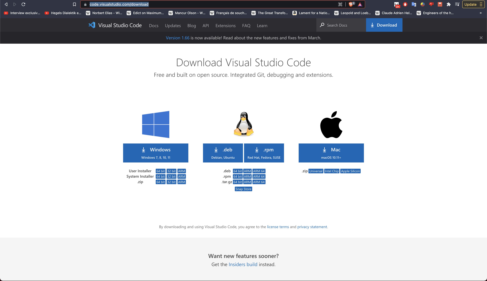

Once there, download a package that uses your
current operating system.

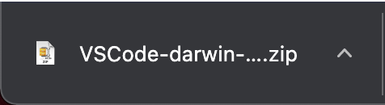

After it's finished installing, open the 
program.

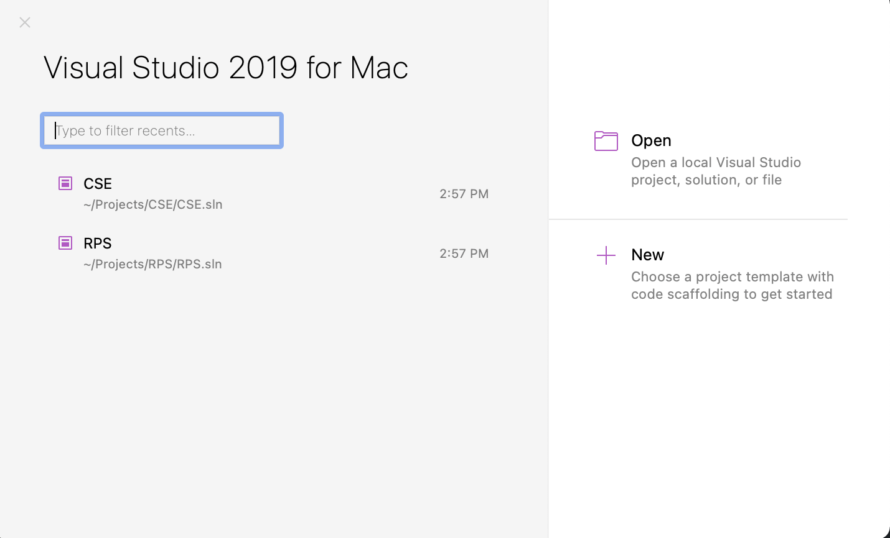

(Since I the operating system I am using is
IOS, it looks like this) and create a new
project.

## Step 2: Remotely Connecting

Go to 
[UCSD Account Lookup](https://sdacs.ucsd.edu/~icc/index.php)
and search for your CSE 15L account.

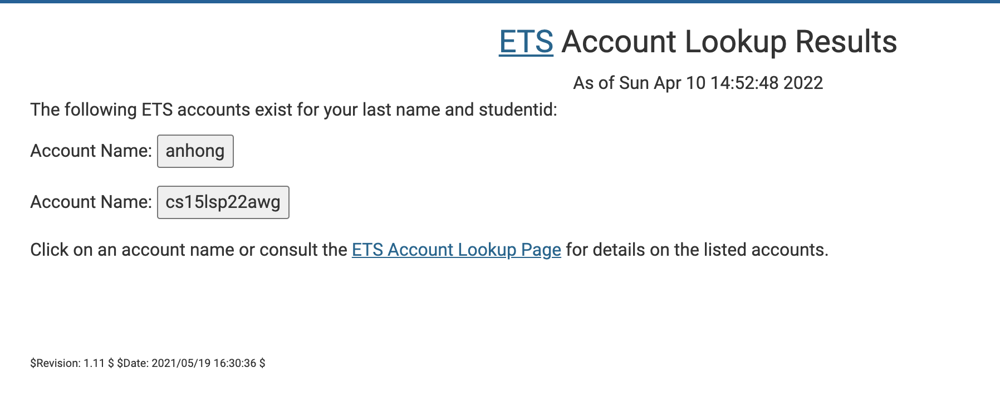

After you find it, type 
ssh cs15lsp22XXX@ieng6.ucsd.edu
into your VScode terminal but replace XXX with your
specific account's id.

You should then get these lines of messages:

>ssh cs15lsp22awg@ieng6.ucsd.edu(in this case, mine is awg)
 
>The authenticity of host 'ieng6.ucsd.edu (128.54.70.227)' can't be established.
 
>RSA key fingerprint is SHA256:ksruYwhnYH+sySHnHAtLUHngrPEyZTDl/1x99wUQcec.
 
> Are you sure you want to continue connecting (yes/no/[fingerprint])?

And you should type yes in the terminal.

It will then prompt your account password.

After you type your password, it should look like:

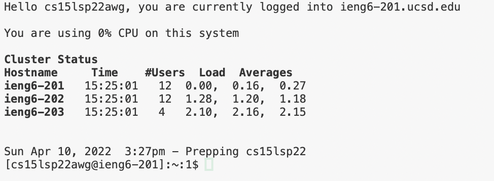

## Step 3: Trying some commands

We can write in the terminal some commands such as 

>ls

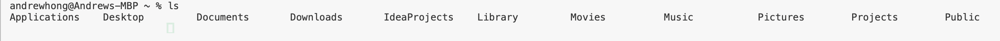

>ls -lat

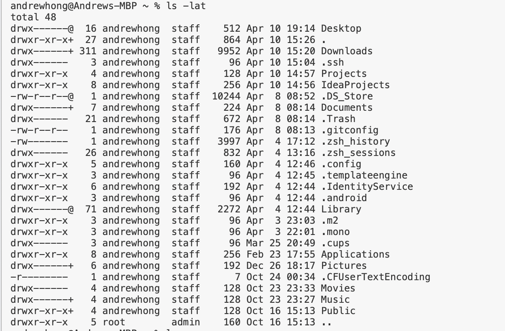

>mkdir

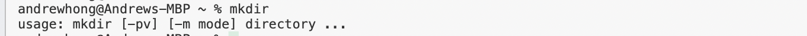

## Step 4: Moving Files with SCP

Create a file named WhereAmI.java

Fill it with the following code:
```
class WhereAmI {
    public static void main(String[] args) {
        System.out.println(System.getProperty("os.name"));
        System.out.println(System.getProperty("user.name"));
        System.out.println(System.getProperty("user.home"));
        System.out.println(System.getProperty("user.dir"));
    }
}
```

Then, in the terminal from the directory where the file is located
type
>scp WhereAmI.java cs15lsp22awg@ieng6.ucsd.edu:~/

which will prompt your password.

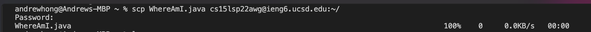

After you confirm the file is there, log in with the process in Step 2 of this tutorial(ssh command).

Then use the 
>ls

command to find the file WhereAmI.

Then run the file WhereAmI.

It should like this:

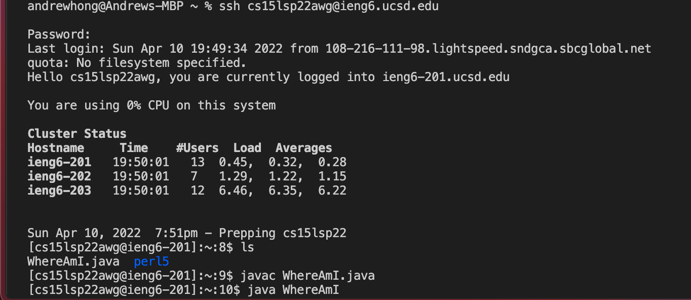

## Step 5: Setting an SSH Key

First, exit out of your account.

Then run command
>ssh-keygen

and save it to Users/<user-name>/.ssh/id_rsa
DO NOT ADD A PASSPHASE

It should look like this:

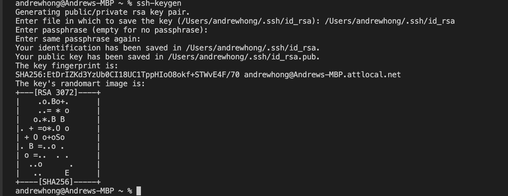

After you have generated a key, type the following
log into your account with the ssh command,
then run mkdir. ssh. Then log out.

After that's done, run the following line on terminal
>scp /Users/<user-name>/.ssh/id_rsa.pub cs15lsp22XXX@ieng6.ucsd.edu:~/.ssh/authorized_keys

Where user-name, account and path file are dependent on your own account.

## Step 6: Optimizing Remote Running

You can use a command such as 

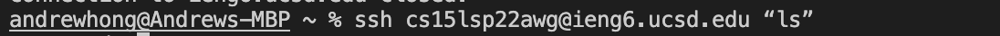

to run the file directly from the remote server,
or you can add semicolons to run multiple commands on one line.
