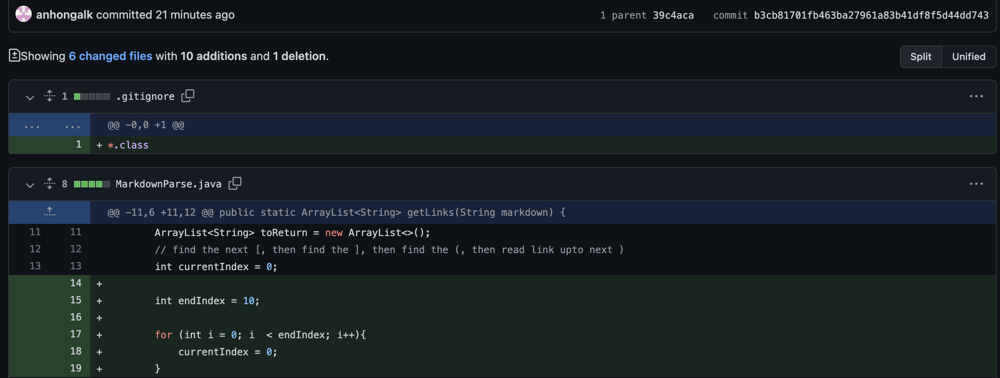
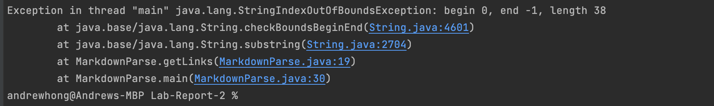
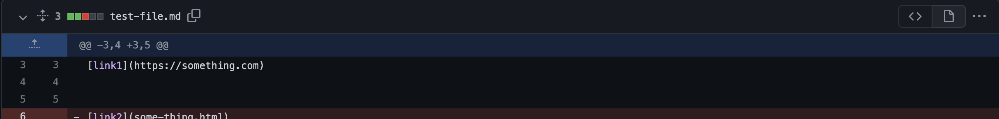
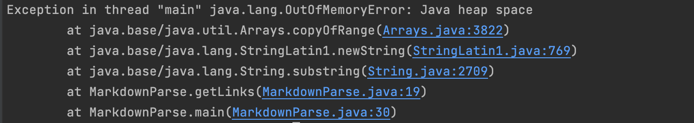
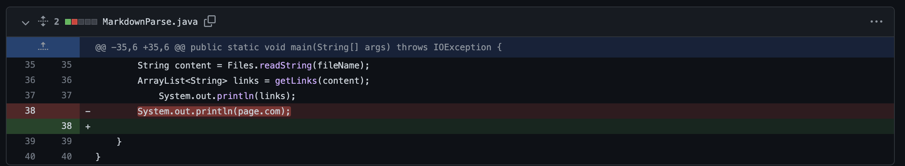
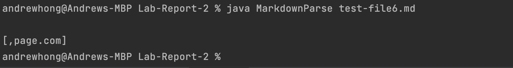

# Lab 3 

## Change 1 (First Change to Code)

Which outputs:

The image is out of bounds, so to resolve that
you should go and check the file and reedit the bounds
so that it stays within the boundaries of the code. The Index
is out of bounds by ending at -1, so we had to remove the extra lines
and the end of the code, in order to solve the problem by resetting it to 0.
We added a for loop to make sure it that it never goes out of bounds to 
negative as well, incrementing each time.

[Test Case 1](https://github.com/anhongalk/Lab-Report-2/blob/main/test-file.md)

## Change 2 (2nd Change to Code)

Which outputs:

Java Heap space was not large enough, so to edit the 
file you should go and edit the link to make sure it 
is formatted correctly. The bug effectively forces there to
not be enough allocated heap space, so by removing last line of code
we solve the issue of allocated heap space.

[Test Case 2](https://github.com/anhongalk/Lab-Report-2/blob/main/test-file2.md)

## Change 3 (Third Change to Code)

Which outputs:

The link is improperly formatted, so to edit the link
you should go and change the file to the proper format, and we
had to delete the system.out.println line, since it was printing out
incorrect information.

[Test Case 3](https://github.com/anhongalk/Lab-Report-2/blob/main/test-file6.md)