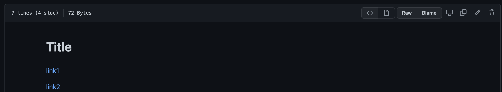
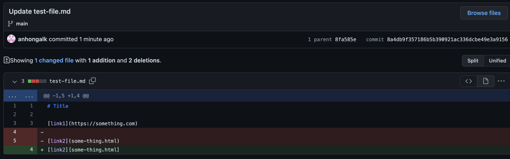
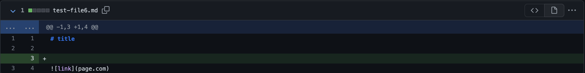

##Lab 3 ##

Change 1

The image is out of bounds, so to resolve that
you should go and check the file and reedit the bounds
to 

[Edits history](https://github.com/anhongalk/Lab-Report-2/commit/8fa585e5a0919fb05a2eaaa994d13612bc39653d)

Change 2

Java Heap space was not large enough, so to edit the 
file you should go and edit the link to make sure it 
is formatted correctly.

So you should edit to 

[Edits history](https://github.com/anhongalk/Lab-Report-2/commit/8a4db9f357186b5b390921ac336dcbe49e3a9156)

Change 3

The link is improperly formatted, so to edit the link
you should go and change the file to the proper format.

[Edits history](https://github.com/anhongalk/Lab-Report-2/commit/aeb9a23b9ce87873da2c048654815ddec6375e0c)