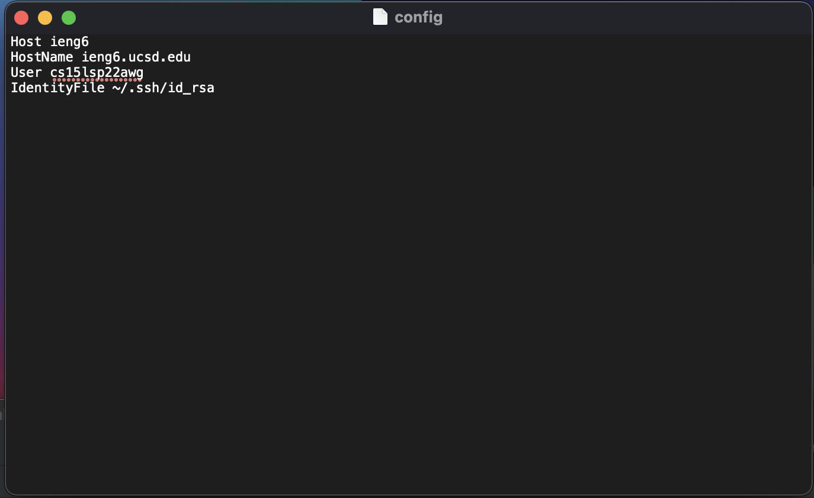

# Lab Report 3

## ssh configuration 

This is the config of the ssh file, I directly edited the file
using text editor, to ensure that it worked.

My login was using this config file using the command ssh ieng6.
The process in which this was preformed was by first creating a config,
which then allows me to login to the ieng account since the config file has
not only the key, but also my username.

I copied to the remote server like so:

## Git and Key generator

Public and private key are both located in the .ssh file.
The public key file looks like:

While the ssh key is:

Here is where my key is stored in Github. The key is by 
the public key I made as part of the remote access lab that I linked
to github.

Comment has been added to the file!

https://github.com/anhongalk/Lab-Report-2/commits/main/MarkdownParse.java

The link to the file that has a commit pushed with a comment "new stuff!"

## Copying an entire directory

