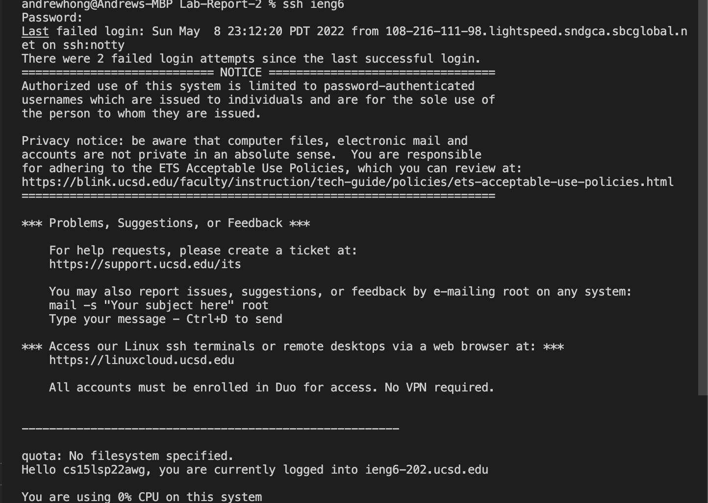

# Lab Report 3

## ssh configuration 

This is the config of the ssh file, I directly edited the file
using text editor, to ensure that it worked.

My login was using this config file using the command ssh ieng6.

##Git and Key generator

Public and private key are both located in the .ssh file.

Here is where my key is stored in Github.