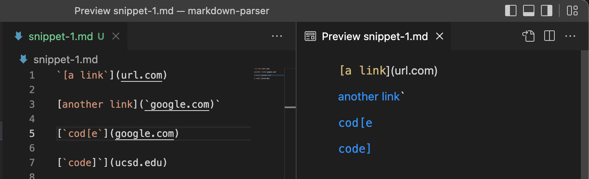
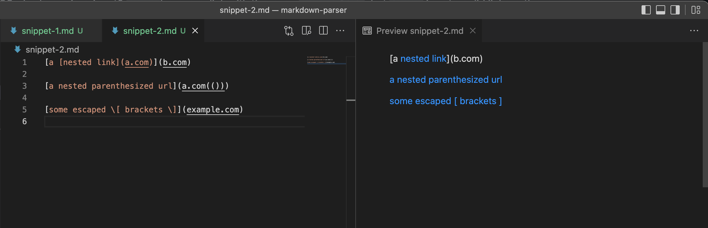
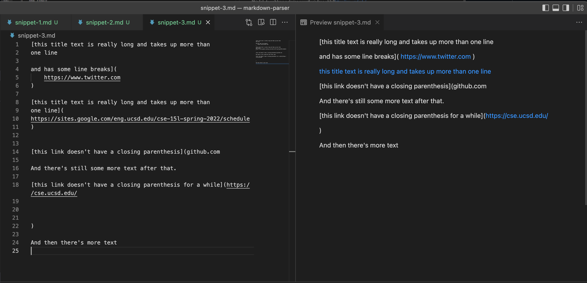
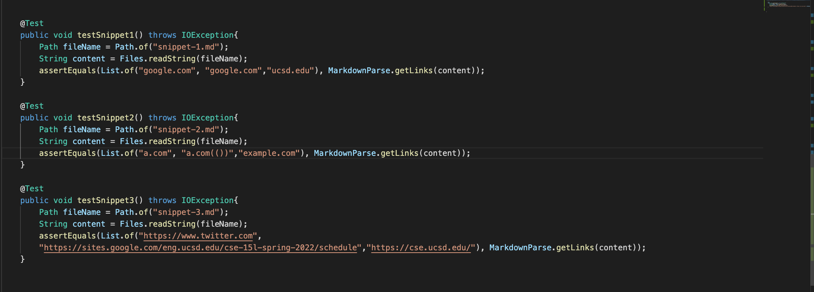
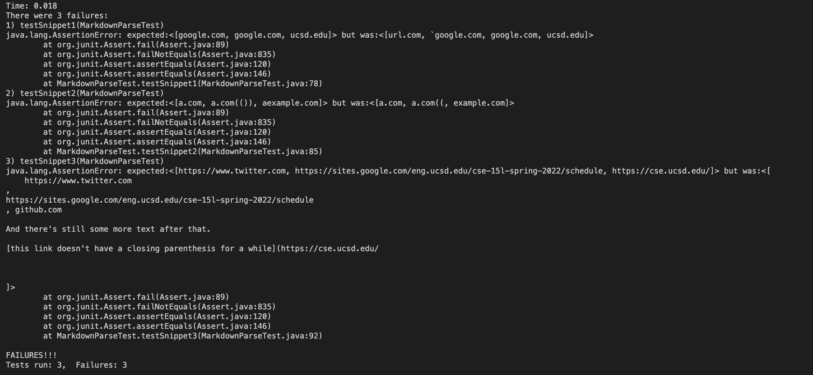
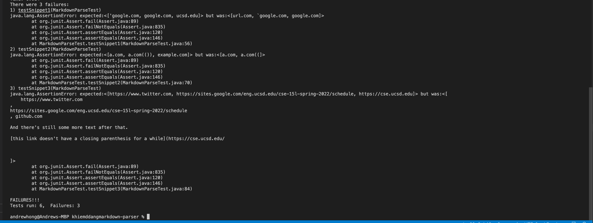

#Lab Report 4

###Snippet 1 and expected output in preview:

###Snippet 2 and expected output in preview:

###Snippet 3 and expected output in preview:

##Linked Repos

[My Repo](https://github.com/anhongalk/markdown-parser) and
[Reviewed Repo](https://github.com/TuannDang/markdown-parser)

##The Tests we are running:

##Results:

My Repo's results:

Reviewed Repo's results:

##Ideas to improve code:
Snippet 1:
I think there is a change in which I can fix the error while 
simultaneously remaining under 10 lines. The way to fix this error
would be by including an if statement to 
make sure that there are valid amount of backticks.
If there are more than 1 back ticks, then the link would remain invalid.

Snippet 2: There is a way to change my code in less than 10 lines to fix the error.
The way to do this in my code would to include an index to track the last
closed parenthesis within the code. The index only is valid when it has reached
the final closed parenthesis.

Snippet 3: I don't think this could be easily solved within 10 lines.
I could add an index to track all the spaces until completion, and I could add an index to track until
it reached the closed parenthesis, and then finally if all the information is valid, 
return the arrayList, but this is convoluted and would certainly take more than 10 lines.

