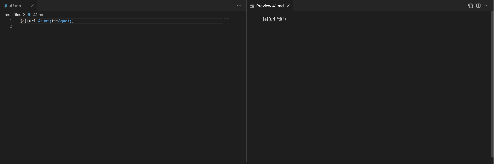
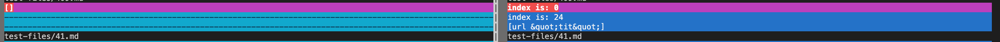

# Lab Report 5

The tests with different results were found by using vimdiff. 
The results were derived from a bash for loop.

## Tests
[487](https://github.com/nidhidhamnani/markdown-parser/blob/main/test-files/487.md) and
[41](https://github.com/anhongalk/markdown-parser-1/blob/main/test-files/41.md)

#### Test 487

The expected output for 487 is [] determined from the VScode preview:

This is the result from vimdiff:

The correct output [] is on the left, which is the provided one.
My output(right) is incorrect since it adds everything in the parenthesis to the return.

The problem with my implementation is that it does not check if / is the first character in the list.
There's not a link that begins with /, so I would add an if statement to check if / is the first character after the open parthenesis.
If there is, then don't return.

#### Test 41

The expected output for 41 is [] determined from the VScode preview:

This is the result from vimdiff:

The provided implementation correctly returns [].
My implementation(right) returns everything in the parenthesis, which is incorrect.

I think the issue is that my implementation adds everything in the parenthesis, by first
checking if it satisfies the first requirement(if letters in [] is valid), and then adding without regard for whether information in the parenthesis is even correct. 
The way to solve this
is to change the current code (adding everything in the open parenthesis), removing this section entirely. If there isn't a valid url determined by going through and iterating, which
is the way that the implementation checks, then it should return an empty arraylist.

