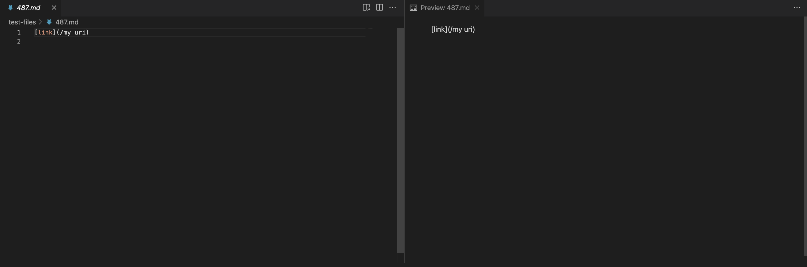
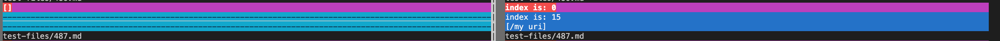
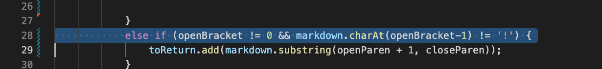
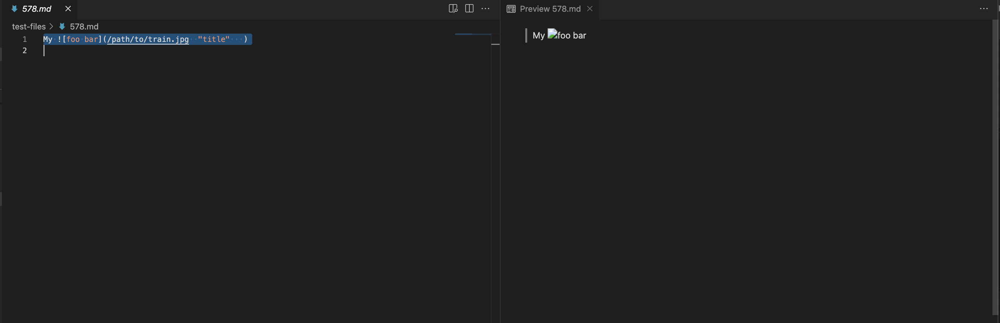
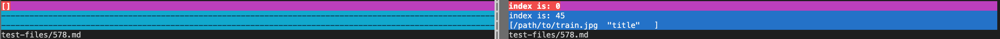
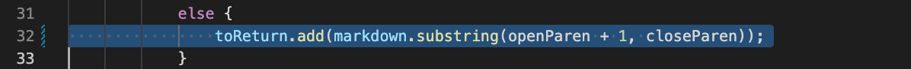

# Lab Report 5

The tests with different results were found by using vimdiff. 
The results were derived from a bash for loop.

## Tests
[487](https://github.com/nidhidhamnani/markdown-parser/blob/main/test-files/487.md) and
[578](https://github.com/anhongalk/markdown-parser-1/blob/main/test-files/578.md)

#### Test 487

The expected output for 487 is [] determined from the VScode preview:

This is the result from vimdiff:

The correct output [] is on the left, which is the provided one.
My output(right) is incorrect since it adds the link to the return.

The problem with my implementation is that it does not check if / is the first character in the list.
There's not a link that begins with /, so I would add an if statement to check if / is the first character after the open parthenesis.
If there is, then don't return.

#### Test 578 

The expected output for 578 is [] determined from the VScode preview:

This is the result from vimdiff:

The provided implementation correctly returns [].
My implementation(right) returns everything in the brackets, which is incorrect.

I think the issue is that my implementation adds everything in the parenthesis.
if it satisfies the first requirement, which is checking if [] is valid. The way to solve this
is to change adding everything in the open parenthesis, and checking if the there is quotation marks ""
by iteratively going through each letter in the parenthesis brackets. If there is, break and end the while loop that will
iteratively check each letter.

